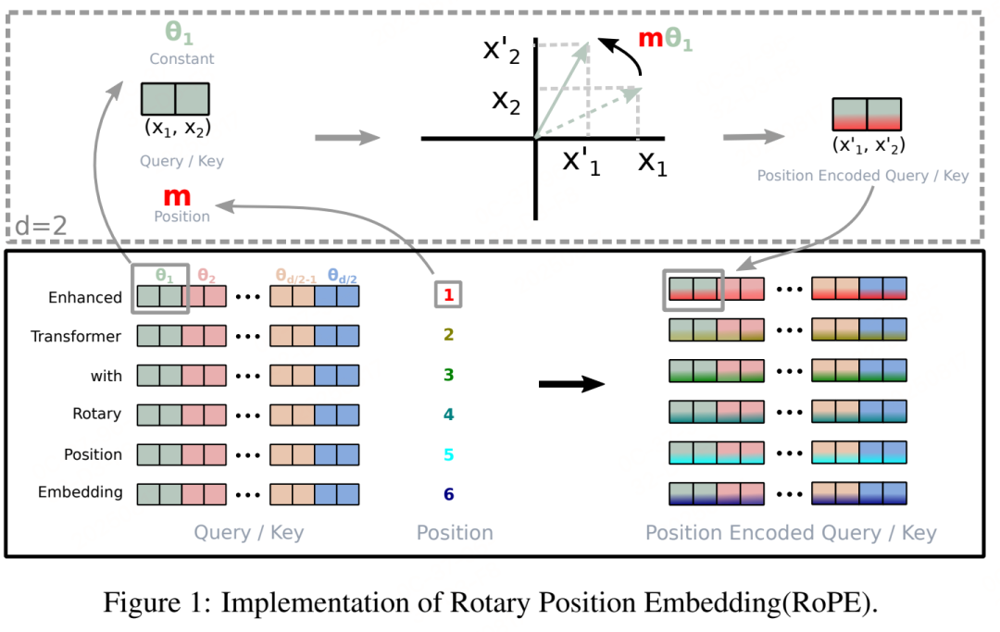

# 26.1月汇报 Qwen3-VL

## **一. 模型架构**


## **二. 2D-RoPE计算详解**

### 1、参数设定
- **嵌入维度**：`d_model = 8`（实际常用768、1024等）
- **频率基数**：`base = 10000`（行和列通常使用相同基数，也可不同）
- **测试位置**：
  - 位置0：`(row=1, col=2)`
  - 位置1：`(row=3, col=4)`

### 2、频率向量计算

对于维度 i（0 ≤ i < d_model/2），频率计算公式为：  
- θ<sub>i</sub> = base<sup>-2i/d_model</sup>

当 d_model=8 时，共有4个频率（对应4组复数对）：

| i | 计算公式 | 近似值 |
|---|---------|-------|
| 0 | $1000^{-\frac{0}{8}}$ = 1 | 1.0 |
| 1 | 1000^{-\frac{2}{8}} | 0.1 |
| 2 | 10000^(-4/8) = 10000^(-0.5) | 0.01 |
| 3 | 10000^(-6/8) = 10000^(-0.75) | 0.001 |

### 3、旋转角度计算

对于位置 (row, col)，每个维度的旋转角度为：   
- φ<sub>i</sub> = row × θ<sub>i</sub> + col × θ<sub>i</sub>

**位置0 (1,2)：**
- φ₀ = 1×1 + 2×1 = 3
- φ₁ = 1×0.1 + 2×0.1 = 0.3
- φ₂ = 1×0.01 + 2×0.01 = 0.03
- φ₃ = 1×0.001 + 2×0.001 = 0.003

**位置1 (3,4)：**
- φ₀ = 3×1 + 4×1 = 7
- φ₁ = 3×0.1 + 4×0.1 = 0.7
- φ₂ = 3×0.01 + 4×0.01 = 0.07
- φ₃ = 3×0.001 + 4×0.001 = 0.007

### 4、旋转矩阵应用

将8维嵌入向量视为4个复数对：  
```
[(q₀, q₁), (q₂, q₃), (q₄, q₅), (q₆, q₇)]
```
对每个复数对应用旋转矩阵：
```
q'_{2i}   = q_{2i} cos φ_i - q_{2i+1} sin φ_i
q'_{2i+1} = q_{2i} sin φ_i + q_{2i+1} cos φ_i
```


### 5、实例计算（位置0）

**原始向量：**  
```
q = [1, 0, 0, 1, 0.5, 0.5, 1, 1]
```
**第一组 (i=0, φ=3)：**
- cos(3) ≈ -0.9899925, sin(3) ≈ 0.1411200
- q₀' = 1 × (-0.9899925) - 0 × 0.1411200 = -0.9899925
- q₁' = 1 × 0.1411200 + 0 × (-0.9899925) = 0.1411200

**第二组 (i=1, φ=0.3)：**
- cos(0.3) ≈ 0.9553365, sin(0.3) ≈ 0.2955202
- q₂' = 0 × 0.9553365 - 1 × 0.2955202 = -0.2955202
- q₃' = 0 × 0.2955202 + 1 × 0.9553365 = 0.9553365

**第三组 (i=2, φ=0.03)：**
- cos(0.03) ≈ 0.9995500, sin(0.03) ≈ 0.0299955
- q₄' = 0.5 × 0.9995500 - 0.5 × 0.0299955 = 0.48477725
- q₅' = 0.5 × 0.0299955 + 0.5 × 0.9995500 = 0.51477275

**第四组 (i=3, φ=0.003)：**
- cos(0.003) ≈ 0.9999955, sin(0.003) ≈ 0.00299999
- q₆' = 1 × 0.9999955 - 1 × 0.00299999 = 0.99699551
- q₇' = 1 × 0.00299999 + 1 × 0.9999955 = 1.00299549

**旋转后向量：**  
```
q' = [
  -0.9899925, 0.1411200,
  -0.2955202, 0.9553365,
  0.48477725, 0.51477275,
  0.99699551, 1.00299549
]
```

### 6、注意力分数计算

#### a. 计算位置1的键向量旋转

**原始键向量：**  
```
k = [0, 1, 1, 0, 0.5, 0.5, 1, 1]
```
**旋转角度：** φ₀=7, φ₁=0.7, φ₂=0.07, φ₃=0.007

**旋转后键向量：**  

```
k' = [  
  -0.6569866, 0.7539023,      # i=0, φ=7  
  0.7648422, 0.6442177,       # i=1, φ=0.7  
  0.4637923, 0.5337351,       # i=2, φ=0.07  
  0.99297554, 1.00697546      # i=3, φ=0.007 
]
```
#### b. 点积计算
score = q' · k' = Σ(q'_i × k'_i)

各项乘积：
- (-0.9899925)×(-0.6569866) ≈ 0.650
- 0.1411200×0.7539023 ≈ 0.106
- (-0.2955202)×0.7648422 ≈ -0.226
- 0.9553365×0.6442177 ≈ 0.615
- 0.48477725×0.4637923 ≈ 0.225
- 0.51477275×0.5337351 ≈ 0.275
- 0.99699551×0.99297554 ≈ 0.990
- 1.00299549×1.00697546 ≈ 1.010

**总分：** 0.650+0.106-0.226+0.615+0.225+0.275+0.990+1.010 = 3.645

此分数已编码了两个位置的相对位置信息。

---


## **三. 频率基插值**

### 3.1 频率基数学定义
频率基：
```
θ_d = 1 / 10000^(2d/D), d = 0,1,...,D/2-1
```
其中D是维度，d是维度索引。

### 3.2 插值的核心思想
Qwen3-VL使用**频率基缩放**来适应新的网格尺寸。具体过程：

设预训练时：
- 垂直方向最大位置索引：M_pretrain = 23 (24个patch，索引0-23)
- 水平方向最大位置索引：N_pretrain = 23

新图像(9376×1248)：
- 垂直方向最大位置索引：M_new = 88 (89个patch，索引0-88)
- 水平方向最大位置索引：N_new = 669 (670个patch，索引0-669)

### 3.3 计算缩放因子
```
s_h = (M_pretrain + 1) / (M_new + 1) = 24/89 ≈ 0.2697
s_w = (N_pretrain + 1) / (N_new + 1) = 24/670 ≈ 0.03582
```

### 3.4 调整后的频率基
新的频率基通过原始频率基的幂运算得到：
```
θ_h,d^new = θ_d^s_h = (10000^(-2d/D))^s_h = 10000^(-2d·s_h/D)
θ_w,d^new = θ_d^s_w = 10000^(-2d·s_w/D)
```

### 3.5 位置编码计算
对于位置(i,j)的patch，其RoPE旋转角度为：
```
φ_h(i,d) = i · θ_h,d^new
φ_w(j,d) = j · θ_w,d^new
```

### 3.6 MRoPE计算
将视频切分成多个时间帧，对于位置(t,i,j)的patch，其RoPE旋转角度为：
```
φ_t(t,d) = t · θ_t,d^new
φ_h(i,d) = i · θ_h,d^new
φ_w(j,d) = j · θ_w,d^new
```

## 四. Vision Encoder内部结构和DeepStack处理

### 4.1 Vision Encoder (SigLIP-2) 结构
SigLIP-2是Vision Transformer (ViT) 架构：

1. **Patch嵌入层**：
   ```
   输入 ∈ ℝ^(3×H×W) → Patch投影 ∈ ℝ^(N×D)
   其中 N = (H/P) × (W/P), P=14, D=768或1024
   ```

2. **Transformer层** (L层，如19层)：
   每层包含：
   - 层归一化 (LayerNorm)
   - 多头自注意力 (MSA) with 2D-RoPE
   - 前馈网络 (FFN)

   数学上，第l层：
   ```
   z_l' = LN(z_{l-1}) + MSA(LN(z_{l-1}))
   z_l = z_l' + FFN(LN(z_l'))
   ```
   其中MSA应用了2D-RoPE位置编码。

### 3.2 DeepStack特征选择
假设Vision Encoder有19层，DeepStack选择第6, 12, 18层的输出：

设第l层输出为 F_l ∈ ℝ^(N×D_v)，其中 D_v = 768：

- F_6 ∈ ℝ^(59630×768) - 中级特征
- F_12 ∈ ℝ^(59630×768) - 高级特征  
- F_18 ∈ ℝ^(59630×768) - 深层语义特征

### 3.3 每个特征的处理流程
对于每个选中的特征 F_l：

1. **MLP投影**：
   ```
   F_l' = σ(F_l W_1^(l) + b_1^(l)) W_2^(l) + b_2^(l)
   ```
   W_1^(l) ∈ ℝ^(768×2048), W_2^(l) ∈ ℝ^(2048×4096)

2. **2×2空间压缩**：
   将 F_l' 重塑为2D网格：
   ```
   G_l = reshape(F_l', (89, 670, 4096))
   ```
   
   2×2平均池化：
   ```
   G_l'[i,j,:] = 1/4 ∑_{m=0}^1 ∑_{n=0}^1 G_l[2i+m, 2j+n, :]
   ```
   输出尺寸：(44, 335, 4096)

3. **展平**：
   ```
   V_l = flatten(G_l') ∈ ℝ^(14740×4096)
   ```

## 4. DeepStack注入LLM

### 4.1 LLM输入序列构造
设文本token序列为 T ∈ ℝ^(L_t×4096)，其中 L_t 是文本长度。

视觉token初始化为0：
```
V_init = 0 ∈ ℝ^(14740×4096)
```
初始LLM输入：
```
H_0 = [T; V_init] ∈ ℝ^((L_t+14740)×4096)
```

### 4.2 注入时间和方式
DeepStack在LLM的**前3层**注入视觉特征：

**第1层注入**：
1. LLM第1层处理：
   ```
   H_1' = LLM-Layer_1(H_0)
   ```
2. 注入 V_6（来自Vision Encoder第6层）：
   ```
   H_1[视觉位置, :] = H_1'[视觉位置, :] + V_6
   ```
   其中视觉位置 = 索引 L_t 到 L_t+14740-1

**第2层注入**：
```
H_2' = LLM-Layer_2(H_1)
H_2[视觉位置, :] = H_2'[视觉位置, :] + V_12
```

**第3层注入**：
```
H_3' = LLM-Layer_3(H_2)
H_3[视觉位置, :] = H_3'[视觉位置, :] + V_18
```

### 4.3 后续层处理
第4层及以后，不再注入新的视觉特征：
```
H_l = LLM-Layer_l(H_{l-1}), l ≥ 4
```

## 三、图像处理流程（以9376×1248为例）

### 1. 视觉编码器（Vision Encoder）
Qwen3-VL使用**SigLIP-2**作为视觉编码器，支持动态分辨率输入。

#### a) Patch分割与线性投影
- **输入图像尺寸**：H = 1248, W = 9376，RGB三通道 ⇒ 张量形状为 `(3, 1248, 9376)`
- **Patch大小**：假设使用14×14（SigLIP常见配置）
  - 垂直Patch数：Nh = H/14 = 1248/14 ≈ 89
  - 水平Patch数：Nw = W/14 = 9376/14 ≈ 670
  - 总Patch数：N = Nh × Nw ≈ 89 × 670 ≈ 59,630

- **线性投影**：
  - 每个14×14×3的Patch通过可学习投影矩阵 Wp ∈ ℝ^(14×14×3)×D 映射为D维向量
  - 输入Patch张量形状：`(89, 670, 14, 14, 3)` 展开为 `(89, 670, 588)`
  - 投影计算：Z₀ = Flatten(Patches) · Wp ⇒ 输出形状 `(89, 670, D)`

#### b) 位置编码：2D-RoPE + 插值
采用**2D-RoPE**（Rotary Position Embedding）为每个Patch注入位置信息：
- 对于位置(i,j)的Patch，其对应的RoPE旋转角度为：
  ```
  θᵢ = i · base^(-2d/D)
  θⱼ = j · base^(-2(d+1)/D)
  ```
  其中d为维度索引，`base`为旋转基数（如10,000）
- 对于9376×1248的高分辨率，需对绝对位置嵌入进行**双线性插值**

#### c) 视觉编码器前向传播
SigLIP-2由多层Transformer块组成，每层包括：
- 多头自注意力（MSA）+ RoPE位置编码
- 前馈网络（FFN）
- 残差连接与LayerNorm

**维度变化**：输入`(89,670, D)` → 输出`(89,670, D)`

#### d) 多层特征抽取（DeepStack）
从不同层抽取视觉特征以增强细粒度感知：
- 假设从第l₁, l₂, l₃层抽取特征F₁₁, F₁₂, F₁₃，形状均为`(89,670, D)`
- 每个特征经过独立的**MLP merger**进行降维与对齐：
  ```
  Merger(F₁) = σ(F₁W₁ + b₁)W₂ + b₂
  ```
  输出形状变为`(89,670, D')`

#### e) 2×2特征压缩
为减少视觉token数量，将相邻的2×2个Patch的特征合并为1个视觉token：
- 输入特征图尺寸：89 × 670
- 2×2池化后尺寸：44 × 335 ⇒ 总视觉token数N_visual = 44 × 335 ≈ 14,740
- 输出视觉token张量形状：`(14,740, D')`

#### f) 输入LLM
视觉token与文本token拼接后输入Qwen3 LLM：
- 最终输入序列长度 = 文本token数 + 14,740
- 在长上下文版本中，总序列长度可达256K

## 四、视频处理流程

### 1. 帧采样与分块
- 假设视频时长T秒，帧率f fps
- 采用**长度自适应采样**：根据训练阶段的序列长度限制动态调整采样帧数、fps和最大帧数
- 例如，对于长视频（>2分钟），可能采样1 fps，总帧数N_f = T

### 2. 每帧独立编码
- 每帧通过上述图像处理流程提取视觉token
- 设每帧得到M个视觉token，则N_f帧共得到N_f × M个视觉token

### 3. 时间建模
#### a) 时间位置编码：Interleaved MRoPE
改进MRoPE，将时间、水平、垂直三个维度的旋转频率**交错分配**：
- 对于第t帧、位置(i,j)的token，其旋转角度为三维联合编码：
  ```
  θ_combined = θₜ ⊕ θᵢ ⊕ θⱼ
  ```
  其中⊕表示维度交错的频率组合

#### b) 显式时间戳标记
- 为每一段视频帧插入文本时间戳token，如`<3.0 seconds>`
- 时间戳作为普通文本token输入，使模型直接感知时间信息

### 4. 视频特征融合
- 所有帧的视觉token与时间戳token交错拼接，形成**交错多模态序列**
- 输入LLM的总序列长度 = 文本token数 + N_f × M + 时间戳token数

### 5. 长视频适应（256K上下文）
- 在**Ultra-Long-Context Adaptation**阶段，模型训练时序列长度扩展至262,144
- 视频帧数和每帧token数可灵活调整，确保总token数 ≤ 256K

## 五、关键数学计算与维度总结

| 步骤 | 输入形状 | 操作 | 输出形状 | 关键数学计算 |
|------|----------|------|----------|--------------|
| 图像分块 | (3, 1248, 9376) | 14×14分块 | (59,630, 14, 14, 3) | Nh = H/14, Nw = W/14 |
| 线性投影 | (59,630, 588) | Z = X Wp | (59,630, D) | Wp ∈ ℝ^(588×D) |
| 2D-RoPE | (59,630, D) | 旋转位置编码 | (59,630, D) | θᵢ, θⱼ旋转矩阵 |
| ViT层处理 | (59,630, D) | MSA + FFN | (59,630, D) | Attention(Q,K,V) |
| DeepStack抽取 | 多层(59,630, D) | 取第l1,l2,l3层 | 3×(59,630, D) | 选择指定层输出 |
| MLP Merger | (59,630, D) | 两层MLP | (59,630, D') | σ(XW₁+b₁)W₂+b₂ |
| 2×2压缩 | (89×670, D') | 相邻2×2合并 | (44×335, D') | 平均或线性投影 |
| 视频帧堆叠 | N_f×(M, D') | 拼接所有帧 | (N_f×M, D') | 沿序列维度concat |
| 时间戳插入 | (N_f×M, D') | 插入文本token | (N_f×M + N_ts, D') | 文本嵌入查找 |
| 输入LLM | 总序列长度L | 与文本拼接 | (L, D') | 256K上下文支持 |

